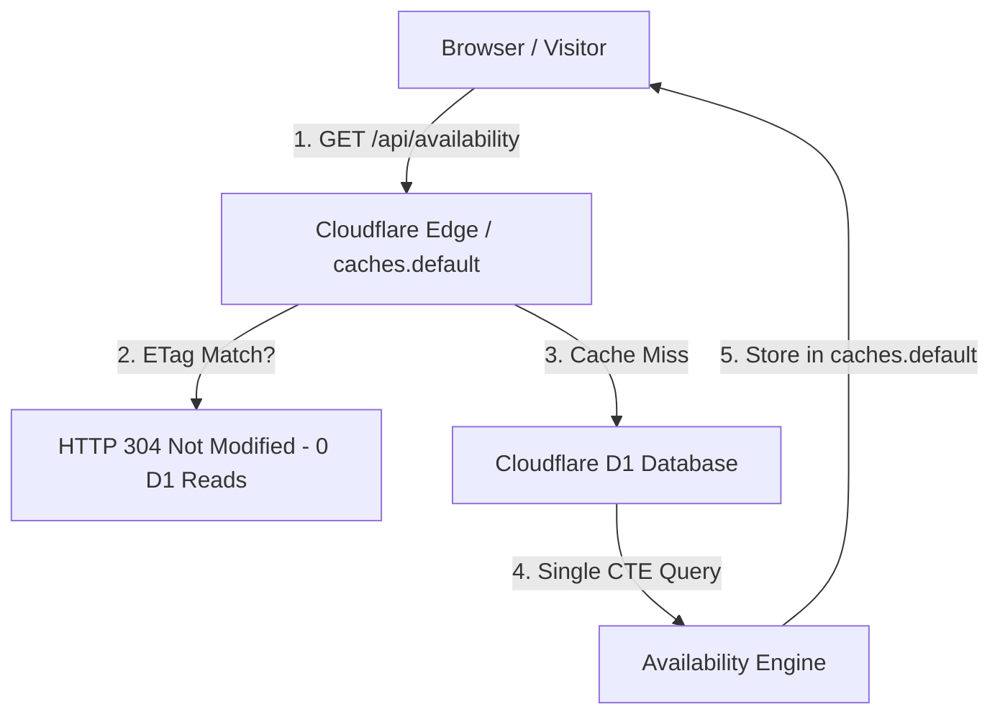

# 📅 CloudMeet (Maintained Fork)

[](https://github.com/delta-whiplash/CloudMeet/actions/workflows/ci.yml)


> **Long-Term Maintained Fork** of [dennisklappe/CloudMeet](https://github.com/dennisklappe/CloudMeet).  
> A high-performance, open-source meeting scheduler (Calendly alternative) engineered for production reliability, zero-cost operational overhead, and automated lifecycle maintenance.

---

## 🌟 Why This Fork?

While the original CloudMeet project established a great foundation, this fork has been refactored for **long-term production stability**, **ultra-low operational cost**, and **hands-off automated maintenance**:

- 🤖 **100% Automated Maintenance**: Hands-free dependency updates via Dependabot, automated CI validation on Node 24 LTS, and auto-merging of non-breaking patches.
- ⚡ **Zero-Cost Edge Caching (`caches.default`)**: Bypasses Cloudflare KV's 1,000 write/day quota limit by utilizing Cloudflare's **Web Cache API** and HTTP `304 Not Modified` ETags for sub-50ms availability responses.
- 📉 **80% D1 Read Reduction**: Multi-table queries (`users`, `event_types`, `availability_rules`) are consolidated into single SQL Common Table Expressions (CTEs), significantly lowering D1 row read quotas.
- 🧪 **Test-Driven Development (TDD)**: Comprehensive Vitest suite running in CI to guarantee zero regressions across timezone calculations, ETag generation, and cron triggers.
- 🩺 **Production Observability**: Built-in `/api/health` diagnostics endpoint, automated deployment verification CLI (`pnpm run verify-deployment`), and request tracing via `X-Request-Id` headers.

---

## ✨ Features & Capabilities

- 📅 **Dual Calendar Sync**: Support for Google Calendar, Outlook Calendar (Microsoft Graph), or both simultaneously.
- 🎥 **Instant Video Links**: Automated generation of Google Meet or Microsoft Teams meeting links.
- ⏰ **Customizable Schedules**: Weekly availability rules with single-day overrides and buffer times.
- 🎨 **White-Labeling & Branding**: Custom event slugs, colors, logos, and email templates.
- ✉️ **Automated Reminders**: Built-in reminder dispatch (24h, 1h) powered by a smart fast-exit cron worker.
- 💸 **0$ Hosting Overhead**: Runs entirely within Cloudflare's generous free tier (Pages, D1, KV, Workers).

---

## 🚀 Quick Start (Local Development)

### 1. Prerequisites & Installation

Ensure you have **Node.js 24 LTS** and **pnpm v11+** installed:

```bash
# Clone repository
git clone https://github.com/delta-whiplash/CloudMeet.git
cd CloudMeet

# Copy environment variables
cp .env.example .dev.vars

# Install dependencies
pnpm install

# Run automated deployment verification
pnpm run verify-deployment

# Initialize local SQLite / D1 database schema
pnpm run db:init

# Start development server
pnpm run dev
```

### 2. Run Test Suite (TDD)

```bash
# Run Vitest unit & edge case tests once
pnpm test

# Run Vitest in watch mode
pnpm run test:watch
```

---

## 🛠️ Production Deployment (Cloudflare Pages)

### Step 1: Set Up Cloudflare & OAuth Secrets

In your GitHub Repository, navigate to **Settings** > **Secrets and variables** > **Actions** and add:

| Secret | Required | Description |
| :--- | :--- | :--- |
| `CLOUDFLARE_API_TOKEN` | Yes | Token with Pages & D1 Edit permissions |
| `CLOUDFLARE_ACCOUNT_ID` | Yes | Your Cloudflare Account ID |
| `ADMIN_EMAIL` | Yes | Email authorized to log into the dashboard |
| `JWT_SECRET` | Yes | Random 32+ char secret for JWT session tokens |
| `APP_URL` | Yes | App domain (e.g. `https://meet.yourdomain.com`) |
| `GOOGLE_CLIENT_ID` | Yes | Google OAuth Client ID |
| `GOOGLE_CLIENT_SECRET` | Yes | Google OAuth Client Secret |
| `EMAILIT_API_KEY` | Optional | Emailit API key for booking emails |
| `MICROSOFT_CLIENT_ID` | Optional | Microsoft Azure App Client ID |
| `MICROSOFT_CLIENT_SECRET` | Optional | Microsoft Azure App Client Secret |

### Step 2: Initialize Remote D1 Database

Before your first deployment, initialize the D1 database tables:

```bash
pnpm run db:init:remote
```

### Step 3: Trigger Continuous Deployment

Push your code to `main` or trigger the **Deploy to Cloudflare Pages** workflow via GitHub Actions (`workflow_dispatch`).

---

## 📊 Self-Hosting Observability & Diagnostics

- **Health Endpoint (`GET /api/health`)**: Returns structured JSON assessing D1 connection, schema table presence, KV status, and required environment variables.
- **Deployment Verification CLI (`pnpm run verify-deployment`)**: Checks `wrangler.toml` bindings, validates secrets, and detects trailing newlines.
- **Request Tracing**: All server responses return an `X-Request-Id` header for end-to-end log correlation.

---

## 🏛️ Architecture & Optimization Strategy



<details>
<summary><strong>How does this fork eliminate KV Write limits?</strong></summary>

Cloudflare KV restricts free tiers to 1,000 writes/day. Instead of writing availability calculations into KV on every request, this fork uses Cloudflare's **Web Cache API (`caches.default`)**, which provides **unlimited, free edge caching**, backed by HTTP `ETag` validation.
</details>

<details>
<summary><strong>How is long-term maintenance automated?</strong></summary>

Dependabot scans dependencies daily. When a patch or minor update is available, GitHub Actions runs the Vitest test suite and deployment verification on Node 24 LTS. If all tests pass, the PR is automatically merged into `main` (`gh pr merge --auto`).
</details>

---

## 📄 License

Distributed under the **MIT License**. See [`LICENSE`](LICENSE) for more information.
